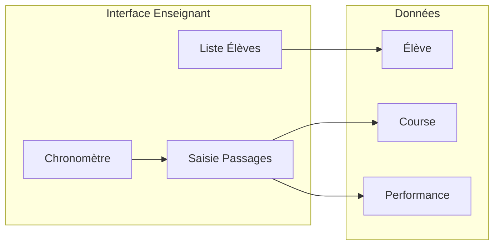

# Architecture

## Objet

Ce document décrit la structure cible, les composants et les choix technologiques de Chrono EPS.

## Vue d'ensemble

Application PWA **client-only** : pas de backend obligatoire pour la première version. Stockage local (IndexedDB ou équivalent) pour données hors ligne. [UNCERTAIN] Backend léger ultérieur pour synchro ou sauvegarde cloud.

## Principes d'interface

| Principe | Description |
|----------|--------------|
| **Moderne** | Typographie claire, espacements généreux, animations discrètes, respect des guidelines tactiles (zones de tap suffisantes). |
| **Agréable** | Palette cohérente, contrastes lisibles en extérieur (usage terrain), feedback visuel immédiat sur les actions. |
| **Épuré** | Pas de surcharge visuelle ; hiérarchie d'information claire ; un objectif principal par écran. |
| **Fonctionnel** | Priorité à l'efficacité : actions fréquentes en un tap, chronos et listes participants toujours visibles ou rapidement accessibles. |

## Composants

| Composant | Responsabilité | Emplacement / Tech cible |
|-----------|----------------|--------------------------|
| **UI Chronomètre** | Affichage temps en cours (ou temps total pour course chargée), boutons start/stop/reset/nouvelle course ; en vue détail : Dupliquer (créer course à partir de) | src/components/Chronometre.vue |
| **Liste Élèves** | Gestion et sélection des élèves pour une course | src/ |
| **Saisie Passages** | Enregistrement des passages (tap sur élève, enregistrement timestamp) | src/ |
| **Tableau relais** | Affichage « Couru » / « Prochain » par groupe, tap par groupe | src/components/ |
| **Stockage local** | Persistance des données (élèves, courses, passages, performances) ; liste, chargement, suppression | IndexedDB (Dexie.js) |
| **Couche PWA** | Service worker, manifeste ; installation, cache, offline | public/, sw.js ou équivalent |
| **UI responsive** | Layout adapté tablette et smartphone | PrimeVue |

## Stack technologique

- **Build** : Vite.
- **Front-end** : Vue 3 + PrimeVue.
- **PWA** : vite-plugin-pwa (Workbox) ; manifeste et service worker générés automatiquement.
- **Tests** : Vitest (exécution, assertions) + @vue/test-utils (composants Vue) + jsdom (environnement DOM).
- **Données** : IndexedDB via Dexie.js ; pas de base distante pour la v1.
- **Déploiement** : GitHub Pages (phase 1) ; PWABuilder pour publication sur les stores (phase 2).

## Modèle d'exécution

- **SPA** : Une seule page applicative ; navigation interne par routes ou états.
- **Chargement** : L'utilisateur ouvre l'URL ; l'app charge depuis le serveur (ou cache PWA).
- **Données** : Lecture/écriture locale uniquement ; pas d'appels réseau obligatoires pour le cœur fonctionnel.
- **Offline** : [ASSUMPTION] Lecture et écriture des données en local possible hors connexion ; stratégie de cache PWA à définir.

## Fichiers et répertoires cibles

- `src/` : Code source de l'application (composants, logique, état).
- `src/**/*.test.js`, `src/**/*.spec.js` : Tests unitaires et de composants.
- `public/` : Fichiers statiques (index.html, favicon, manifeste PWA).
- `docs/` : Documentation (SPEC, DOMAIN, ARCH, WORKFLOW, ADR).
- `dist/` ou `build/` : Sortie du build de production.
- Fichier de config build (ex. `vite.config.js`) à la racine.

## Publication sur les stores (phase 2)

Voir le guide détaillé : [PUBLISHING_STORES.md](PUBLISHING_STORES.md).

Résumé : (1) App déployée sur URL HTTPS (ex. `https://xxx.github.io/chrono-eps/`) ; (2) Valider manifeste et service worker (Lighthouse PWA) ; (3) [PWABuilder](https://pwabuilder.com/) : saisir l'URL, « Package for stores », télécharger paquets Android et iOS ; (4) Soumettre à Play Store (TWA) et App Store (wrapper WebKit).

## Hypothèses et incertitudes

- [UNCERTAIN] Backend futur pour synchro ou multi-appareils.
- [UNCERTAIN] Stratégie de cache PWA précise (assets, données, etc.).
