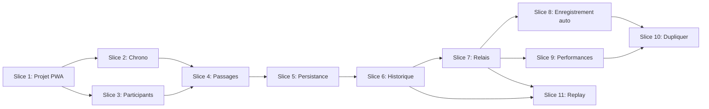

# Plan

## Phase actuelle

Slice 7 — Mode relais (complet). Slice 9 — Performances (complet). Slice 11 — Replay (complet). Slice 10 — Dupliquer : réouverte (masquée en attente retours utilisateurs). **Vue compacte mode individuel** : implémentée en parallèle de la vue tableau (à l’essai auprès des professeurs). Prochain : Slice 8.

## Slices

| Slice | Objectif                 | Livrables                                   | Statut   |
| ----- | ------------------------ | ------------------------------------------- | -------- |
| 1     | Projet + PWA de base     | Scaffold, layout, build, PWA installable     | Fait     |
| 2     | Chronomètre global       | Chrono, start/stop/reset, tours (mode solo)   | Fait     |
| 3     | Gestion participants     | Ajout/suppression, liste, UI tactile         | Fait     |
| 4     | Passages et calculs      | Tap = passage, temps tour/course, affichage  | Fait     |
| 5     | Persistance + sauvegarde | IndexedDB, sauvegarde course nommée          | Fait     |
| 6     | Historique + déploiement | Vue historique, PWA final, GitHub Pages     | Fait     |
| 7     | Mode relais              | Groupes, config élèves, Couru/Prochain, course continue jusqu'à arrêt | Fait     |
| 8     | Enregistrement auto      | Sauvegarde à chaque changement, nom auto, renommage depuis historique | À faire  |
| 9     | Performances (P1, P2, …) | Liste temps de passage par tour, mode individuel et relais | Fait     |
| 10    | Dupliquer                | Bouton Dupliquer à côté du chrono, création course à partir d'une existante | Réouverte (masqué) |
| 11    | Replay                   | Piste virtuelle, marqueurs par participant, contrôles play/pause/slider, mode individuel et relais | Fait    |

## Objectif MVP

Application fonctionnelle permettant à un enseignant d'EPS de : (1) paramétrer des participants, (2) lancer un chronomètre, (3) enregistrer les passages par tap, (4) consulter les temps (tour et course), (5) sauvegarder une course nommée, (6) consulter l'historique, (7) installer en PWA. Référence : [SPEC.md](SPEC.md), [DOMAIN.md](DOMAIN.md).

---

## Slice 1 — Projet et PWA de base

**Objectif** : Projet Vite + Vue 3 + PrimeVue opérationnel, PWA configurables, layout responsive.

**Critères de sortie** : App buildable, PWA installable (ou prête à l'être), layout responsive.

### Tâches

- [x] Créer projet Vite (template Vue)
- [x] Installer PrimeVue, configurer thème (Luna ou Aura)
- [x] Configurer vite-plugin-pwa (manifeste, service worker)
- [x] Layout de base (App.vue, structure)
- [x] Page d'accueil minimale
- [x] Build (`npm run build`) et dev (`npm run dev`) OK
- [x] Déploiement test GitHub Pages (optionnel)

---

## Slice 2 — Chronomètre global

**Objectif** : Chronomètre affiché, contrôle start/stop/reset, comptage de tours (mode solo).

**Critères de sortie** : Chrono visible, démarrage/arrêt/réinit fonctionnels, enregistrement des passages par tour.

### Tâches

- [x] Composant Chronometre (affichage mm:ss.ms)
- [x] Logique timer (start, stop, reset)
- [x] Boutons Start / Stop / Reset (PrimeVue)
- [x] Format temps conforme DOMAIN (mm:ss.ms)
- [x] Bouton Tour (visible en running, zones tactiles ≥ 44px)
- [x] Liste des passages (tours) sous le chrono : Tour N, temps tour, temps total
- [x] Calcul temps tour (écart entre passages) et temps total
- [x] Reset efface passages

---

## Slice 3 — Gestion des participants

**Objectif** : Liste de participants modifiable pour une course.

**Critères de sortie** : Peut ajouter/supprimer des participants avant ou pendant une course.

### Tâches

- [x] Modèle Participant/Élève (nom) en état local
- [x] Liste des participants (affichage)
- [x] Formulaire/modal ajout participant
- [x] Suppression participant
- [x] Zones tactiles adaptées (min 44px)

---

## Slice 4 — Enregistrement des passages et calculs

**Objectif** : Enregistrement des passages au tap sur un élève et calcul des temps.

**Critères de sortie** : Tap sur participant → passage enregistré ; temps de tour et temps de course visibles.

### Tâches

- [x] Associer participants à une course en cours
- [x] Tap sur participant = enregistrement passage (timestamp)
- [x] Liste des passages par élève (tours empilés)
- [x] Affichage par passage : numéro tour, temps tour, temps total (format mm:ss.ms)
- [x] Calcul temps tour = écart entre passages consécutifs ; temps total = depuis démarrage chrono
- [x] Affichage des passages en temps réel
- [x] Affichage performances par participant (temps, tours)

---

## Slice 5 — Persistance et sauvegarde

**Objectif** : Stockage IndexedDB, sauvegarde des courses nommées.

**Critères de sortie** : Course sauvegardée avec nom ; données persistantes après refresh.

### Tâches

- [x] Schéma IndexedDB (Course, Élève, Passage)
- [x] Librairie (Dexie.js ou idb) pour accès IndexedDB
- [x] Sauvegarde course avec nom (modale/formulaire)
- [x] Persistance des courses, participants, passages
- [x] Chargement des données au démarrage app

---

## Slice 6 — Historique et MVP final

**Objectif** : Historique des courses, PWA prête, déploiement.

**Critères de sortie** : MVP complet ; historique consultable ; PWA installable ; déployé sur GitHub Pages.

### Tâches

- [x] Vue / écran Historique des courses
- [x] Liste des courses sauvegardées (nom, date)
- [x] Détail d'une course (performances par participant)
- [x] Manifeste PWA complet (icônes, nom, thème)
- [x] Test installation PWA (navigateur)
- [x] Déploiement GitHub Pages
- [x] Polish UI (principes ARCH : moderne, épuré, fonctionnel)
- [ ] Évaluer tests E2E (Playwright) — optionnel si MVP stable et régressions fréquentes

---

## Slice 7 — Mode relais

**Objectif** : Course relais où chaque participant est un groupe ; élèves courent à tour de rôle en cycle ; configuration des élèves et couleurs avant la course ; affichage « Couru » / « Prochain » ; la course continue jusqu'à l'arrêt par le professeur.

**Critères de sortie** : Sélecteur mode Individuel/Relais ; modal config groupe (élèves ordonnés, couleurs) ; tableau relay avec Couru/Prochain ; jusqu'à 8 groupes (couleurs réutilisées cycliquement) ; sauvegarde et chargement des courses relais.

### Tâches

- [x] Documentation (DOMAIN, SPEC, ARCH)
- [x] Schéma DB v2 : mode, table relay_students
- [x] courseStore : save/load/delete relay
- [x] Modèle : createRelayGroup, createRelayStudent
- [x] useChronometre : support relay (recordPassage groupe, état courant/prochain)
- [x] TableauPassages Relay : Couru/Prochain, tap par groupe
- [x] Modal configuration groupe (liste élèves, couleurs)
- [x] HomeView : sélecteur mode, flux relay

---

## Slice 8 — Enregistrement automatique

**Objectif** : Sauvegarde automatique des courses ; nom auto-généré modifiable depuis l'historique.

**Critères de sortie** : Aucune action manuelle « Enregistrer » ; course persistée à chaque modification ; renommage possible depuis l'historique.

### Tâches

- [ ] Enregistrer à chaque changement significatif (passages, participants, mode, etc.), pas seulement chrono ou tours
- [ ] Nom automatique à la première sauvegarde (ex. « Course 14 fév. 10h30 »)
- [ ] Renommage possible depuis la vue Historique (course déjà sauvegardée)
- [ ] Supprimer les boutons Courses et Enregistrer en bas (issue 3)

---

## Slice 9 — Performances détaillées

**Objectif** : Afficher les temps de passage par tour (P1, P2, P3, …) dans les sections Performances.

**Critères de sortie** : Liste des temps de passage (P1, P2, …) visible pour chaque participant/groupe dans les deux modes.

### Tâches

- [x] Mode individuel (TableauPassages.vue) : liste P1, P2, P3… dans section tableau-passages-resume
- [x] Mode relais (TableauPassagesRelay.vue) : liste P1, P2, P3… dans section tableau-passages-resume (regroupée par élève, total groupe + Total cumulé par élève)
- [x] Compléter ou remplacer affichage actuel (nb tours, dernier total) par liste explicite

---

## Vue compacte mode individuel (expérimental)

**Objectif** : Proposer une alternative à la vue tableau pour le mode individuel, optimisée smartphone : grille de mini-cartes (numéro tappable), temps affichés en dessous, états visuels explicites pour les coureurs actifs/inactifs.

**Livrables** : TableauPassagesCompact.vue ; commutateur Tableau / Compacte dans HomeView et CourseDetailView ; persistance du choix (localStorage).

**Statut** : Implémenté. En évaluation auprès des professeurs. L'ancienne vue tableau reste disponible.

### Ajustements demandés (retours terrain)

- [ ] En mode individuel, quand un coureur est stoppé, conserver sa cellule visible (fond gris), conserver les temps affichés, et afficher un bouton Play vert pour permettre la reprise.

---

## Slice 10 — Dupliquer une course (réouverte)

**Objectif** : Bouton Dupliquer pour créer une nouvelle course à partir d'une existante ; placement en en-tête.

**Critères de sortie** : Bouton « Dupliquer » visible et accessible en haut de la vue détail ; duplique la course courante vers une nouvelle course.

**Statut actuel** : Fonctionnalité masquée (bouton commenté). Slice réouverte pour évolutions à prévoir après consultation des utilisateurs et nouvelles exigences fonctionnelles.

### Tâches

- [x] Renommer « Nouvelle course à partir de » en « Dupliquer » (issue 5)
- [x] Remonter le bouton à côté du chronomètre (Nouvelle course) dans CourseDetailView.vue (issue 6)
- [x] En mode individuel, « Nouvelle course » doit reprendre la configuration des coureurs de la course source et réinitialiser les temps.
- [x] En mode individuel, si la course source contient des temps, pré-trier automatiquement les coureurs par temps total croissant (plus rapide en premier) dans la nouvelle course.

---

## Slice 11 — Replay de course avec piste virtuelle

**Objectif** : Rejouer visuellement une course sauvegardée : piste virtuelle ovale, marqueurs par participant/groupe, position interpolée, nom du coureur actuel en mode relais ; contrôles play, pause et curseur temporel.

**Critères de sortie** : Bouton Replay depuis la vue détail ; piste virtuelle visible ; marqueurs colorés ; position interpolée ; contrôles play/pause/slider ; chrono synchronisé ; mode individuel et relais.

### Tâches

- [x] Bouton Replay dans CourseDetailView (à côté de Dupliquer)
- [x] Vue ReplayView avec piste ovale SVG
- [x] Marqueurs par participant avec couleur, nom (coureur actuel en relay)
- [x] Interpolation linéaire entre passages (useReplay, getPositionAtTime)
- [x] Contrôles play/pause, slider temporel, chrono
- [x] Support mode individuel et relais

---

## Dépendances entre slices

