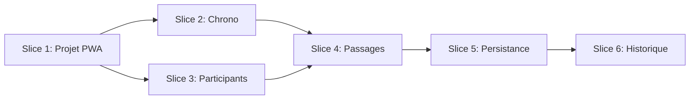

# Plan

## Phase actuelle

Slice 5 — Persistance et sauvegarde (complet).

## Slices

| Slice | Objectif                 | Livrables                                   | Statut   |
| ----- | ------------------------ | ------------------------------------------- | -------- |
| 1     | Projet + PWA de base     | Scaffold, layout, build, PWA installable     | Fait     |
| 2     | Chronomètre global       | Chrono, start/stop/reset, tours (mode solo)   | Fait     |
| 3     | Gestion participants     | Ajout/suppression, liste, UI tactile         | Fait     |
| 4     | Passages et calculs      | Tap = passage, temps tour/course, affichage  | Fait     |
| 5     | Persistance + sauvegarde | IndexedDB, sauvegarde course nommée          | Fait     |
| 6     | Historique + déploiement | Vue historique, PWA final, GitHub Pages     | Todo     |

## Objectif MVP

Application fonctionnelle permettant à un enseignant d'EPS de : (1) paramétrer des participants, (2) lancer un chronomètre, (3) enregistrer les passages par tap, (4) consulter les temps (tour et course), (5) sauvegarder une course nommée, (6) consulter l'historique, (7) installer en PWA. Référence : [SPEC.md](SPEC.md), [DOMAIN.md](DOMAIN.md).

---

## Slice 1 — Projet et PWA de base

**Objectif** : Projet Vite + Vue 3 + PrimeVue opérationnel, PWA configurables, layout responsive.

**Critères de sortie** : App buildable, PWA installable (ou prête à l'être), layout responsive.

### Tâches

- [x] Créer projet Vite (template Vue)
- [x] Installer PrimeVue, configurer thème (Luna ou Aura)
- [x] Configurer vite-plugin-pwa (manifeste, service worker)
- [x] Layout de base (App.vue, structure)
- [x] Page d'accueil minimale
- [x] Build (`npm run build`) et dev (`npm run dev`) OK
- [x] Déploiement test GitHub Pages (optionnel)

---

## Slice 2 — Chronomètre global

**Objectif** : Chronomètre affiché, contrôle start/stop/reset, comptage de tours (mode solo).

**Critères de sortie** : Chrono visible, démarrage/arrêt/réinit fonctionnels, enregistrement des passages par tour.

### Tâches

- [x] Composant Chronometre (affichage mm:ss.ms)
- [x] Logique timer (start, stop, reset)
- [x] Boutons Start / Stop / Reset (PrimeVue)
- [x] Format temps conforme DOMAIN (mm:ss.ms)
- [x] Bouton Tour (visible en running, zones tactiles ≥ 44px)
- [x] Liste des passages (tours) sous le chrono : Tour N, temps tour, temps total
- [x] Calcul temps tour (écart entre passages) et temps total
- [x] Reset efface passages

---

## Slice 3 — Gestion des participants

**Objectif** : Liste de participants modifiable pour une course.

**Critères de sortie** : Peut ajouter/supprimer des participants avant ou pendant une course.

### Tâches

- [x] Modèle Participant/Élève (nom) en état local
- [x] Liste des participants (affichage)
- [x] Formulaire/modal ajout participant
- [x] Suppression participant
- [x] Zones tactiles adaptées (min 44px)

---

## Slice 4 — Enregistrement des passages et calculs

**Objectif** : Enregistrement des passages au tap sur un élève et calcul des temps.

**Critères de sortie** : Tap sur participant → passage enregistré ; temps de tour et temps de course visibles.

### Tâches

- [x] Associer participants à une course en cours
- [x] Tap sur participant = enregistrement passage (timestamp)
- [x] Liste des passages par élève (tours empilés)
- [x] Affichage par passage : numéro tour, temps tour, temps total (format mm:ss.ms)
- [x] Calcul temps tour = écart entre passages consécutifs ; temps total = depuis démarrage chrono
- [x] Affichage des passages en temps réel
- [x] Affichage performances par participant (temps, tours)

---

## Slice 5 — Persistance et sauvegarde

**Objectif** : Stockage IndexedDB, sauvegarde des courses nommées.

**Critères de sortie** : Course sauvegardée avec nom ; données persistantes après refresh.

### Tâches

- [x] Schéma IndexedDB (Course, Élève, Passage)
- [x] Librairie (Dexie.js ou idb) pour accès IndexedDB
- [x] Sauvegarde course avec nom (modale/formulaire)
- [x] Persistance des courses, participants, passages
- [x] Chargement des données au démarrage app

---

## Slice 6 — Historique et MVP final

**Objectif** : Historique des courses, PWA prête, déploiement.

**Critères de sortie** : MVP complet ; historique consultable ; PWA installable ; déployé sur GitHub Pages.

### Tâches

- [ ] Vue / écran Historique des courses
- [ ] Liste des courses sauvegardées (nom, date)
- [ ] Détail d'une course (performances par participant)
- [ ] Manifeste PWA complet (icônes, nom, thème)
- [ ] Test installation PWA (navigateur)
- [ ] Déploiement GitHub Pages
- [ ] Polish UI (principes ARCH : moderne, épuré, fonctionnel)
- [ ] Évaluer tests E2E (Playwright) — optionnel si MVP stable et régressions fréquentes

---

## Dépendances entre slices

